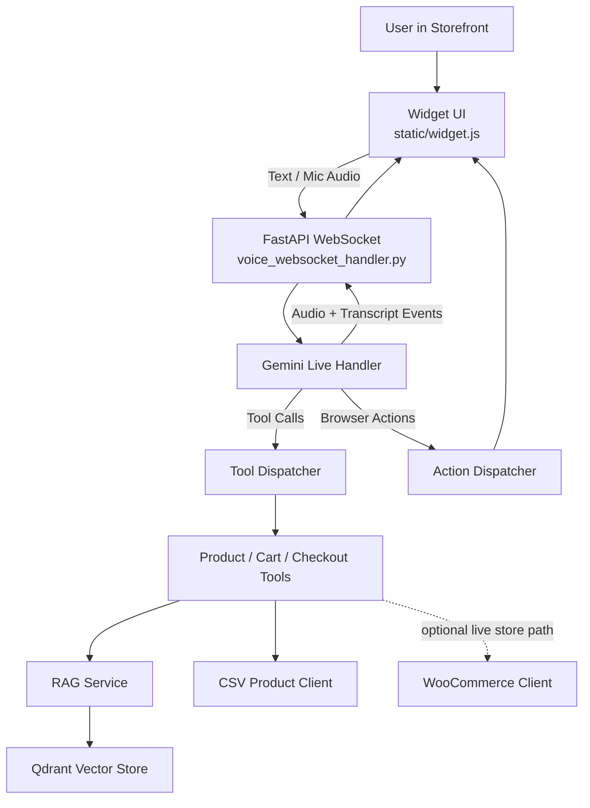

# Voice Commerce Agent

Voice Commerce Agent is a real-time shopping assistant for storefronts. It combines Gemini Live voice interaction, tool calling, semantic product search, and browser actions so a shopper can speak naturally and see the page respond in real time.

The project is structured as a full voice-commerce system: a widget captures user input, a FastAPI backend manages the live session, Gemini calls tools when needed, retrieval augments product search, and browser actions update the storefront UI.

## Preview

<p align="center">
  
</p>

<p align="center"><em>Hero shot: storefront experience with the voice widget open.</em></p>

<table>
  <tr>
    <td width="50%">
      
      <p><strong>Search results in action</strong><br />Shows retrieval, tool calling, and browser highlights working together.</p>
    </td>
    <td width="50%">
      
      <p><strong>Cart and checkout flow</strong><br />Shows the end-to-end purchase funnel with checkout state rendered in the storefront.</p>
    </td>
  </tr>
  <tr>
    <td colspan="2">
      
      <p><strong>Voice-guided filtering and ranking</strong><br />Shows the assistant narrowing results with filters and sorting so the storefront reflects the shopper's constraints.</p>
    </td>
  </tr>
</table>

These screenshots capture the main user journey: greet the shopper, find products with natural language, highlight matches on the page, and move through cart to checkout.

## Features

- Real-time voice and text interaction through Gemini Live
- WebSocket session handling for low-latency storefront conversations
- Tool calling for product search, cart actions, and checkout flow
- Semantic product retrieval with sentence-transformers and Qdrant
- Browser actions for highlights, cart updates, and checkout rendering
- Embeddable widget for storefront integration
- Local storefront page for testing and recording flows

## Current Implementation

The current codebase includes:

- FastAPI backend with route, middleware, and lifespan setup
- Gemini Live integration for streaming conversation
- Retrieval pipeline with embedder, retriever, vector store, and catalog sync
- CSV-backed catalog path for stable local runs
- WooCommerce client path kept in the codebase for real store integration
- In-memory cart and checkout state for the current interaction flow

Planned next-stage improvements include persistent sessions, stronger deployment hardening, and production-grade multi-tenant support.

## Architecture



### Request Flow

1. The widget captures typed input or microphone audio.
2. The FastAPI WebSocket handler opens and manages the live Gemini session.
3. Gemini responds directly or issues tool calls through the dispatcher.
4. Tools query product, cart, checkout, and retrieval services.
5. Tool results return to Gemini as structured context.
6. Gemini sends audio, transcript updates, and browser actions back to the widget.

## Repository Structure

```text
src/voice_commerce/
├── api/
│   ├── middleware/        # middleware such as CORS
│   └── routes/            # thin FastAPI route wiring
├── config/                # environment-backed settings
├── core/
│   ├── actions/           # browser action models and dispatch
│   ├── rag/               # embedder, retriever, vector store
│   ├── state/             # in-memory checkout state
│   ├── tools/             # tool implementations used by Gemini
│   └── voice/             # Gemini live adapter and audio helpers
├── handlers/              # WebSocket session orchestration
├── models/                # Pydantic models
└── services/              # catalog clients and RAG service

static/
├── widget.js              # storefront widget
├── embed_demo.html        # local storefront page
└── test_client.html       # test harness

tests/                     # pytest suite
local/                     # planning docs and implementation notes
docs/demo/                 # screenshots and GIFs for GitHub
```

## Tech Stack

| Layer | Choice |
|---|---|
| Backend | FastAPI |
| Language | Python 3.12 |
| Real-time AI | Gemini Live API |
| Product search | sentence-transformers + Qdrant |
| Data models | Pydantic |
| Config | pydantic-settings |
| Logging | structlog |
| Package manager | uv |

## Running Locally

### Requirements

- Python 3.12+
- `uv`
- Gemini API key

### Setup

```bash
git clone <your-repo-url>
cd voice-commerce-agent
uv sync
cp .env.example .env
```

At minimum, set:

```env
GEMINI_API_KEY=your_key_here
```

WooCommerce variables are also included in `.env.example` for the live-store integration path.

### Start The App

```bash
uv run uvicorn src.voice_commerce.main:app --reload --port 8000
```

Useful local URLs:

- API root: `http://localhost:8000/`
- Health: `http://localhost:8000/health`
- Storefront page: `http://localhost:8000/static/embed_demo.html`
- Widget asset: `http://localhost:8000/static/widget.js`

## Testing

Run the full suite:

```bash
uv run pytest tests/ -v
```

Run a focused file:

```bash
uv run pytest tests/test_health.py -v
```

## Environment Notes

- `.env` is local-only and ignored by Git.
- `.env.example` is the shareable template for GitHub.
- `CORS_ALLOW_ORIGINS=["*"]` is acceptable for local development and should be restricted for deployment.

## Roadmap

- Persist session and checkout state beyond process memory
- Harden deployment configuration and access control
- Expand the live-store integration path
- Improve observability and operational safeguards
- Add multi-tenant support for hosted storefront use

## Good Portfolio Talking Points

- End-to-end voice commerce loop: user input, tool call, browser action, UI update
- Real-time WebSocket orchestration around Gemini Live
- Retrieval-backed product search instead of exact keyword matching
- Separation between tool logic and browser-side effects
- Clear path from local catalog mode to live store integration

## License

This project is licensed under the MIT License. See [LICENSE](LICENSE).
